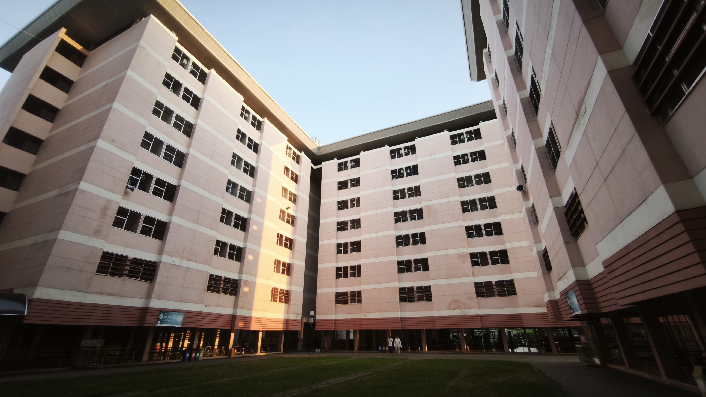
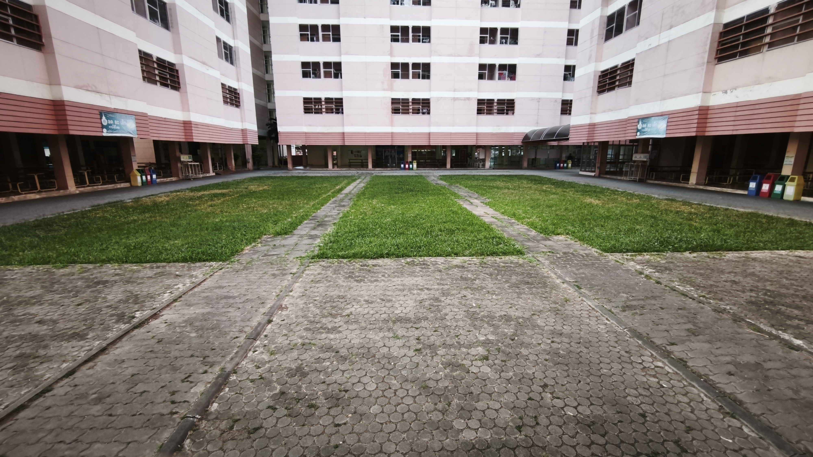
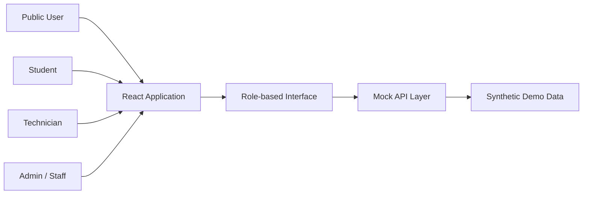

# RMUTI Dormitory System

### ระบบรับแจ้งซ่อมและติดตามงานซ่อมหอพักนักศึกษา

Interactive Frontend Showcase สำหรับมหาวิทยาลัยเทคโนโลยีราชมงคลอีสาน 
ทดลองกระบวนการทำงานครบทั้งนักศึกษา ช่างซ่อม เจ้าหน้าที่ และผู้ใช้งานทั่วไป

**[เปิด Live Demo](https://painter121.github.io/rmuti-dormitory-demo/)** · **[ชมภาพจากเว็บไซต์จริง](#ภาพจากเว็บไซต์จริง)** · **[ดูความสามารถ](#ความสามารถของระบบ)** · **[ผู้พัฒนา](#ผู้พัฒนา)**

`React 19` · `Vite 8` · `Tailwind CSS 4` · `Mock Data แยกจากระบบจริง`

## เกี่ยวกับโปรเจกต์

RMUTI Dormitory System คือเดโมระบบบริหารงานซ่อมหอพักแบบโต้ตอบ ตั้งแต่การแจ้งปัญหา การตรวจสอบและมอบหมายงาน การนัดหมายช่าง การอัปเดตสถานะ ไปจนถึงการดูประวัติและรายงานผล โดยออกแบบหน้าจอและเมนูให้เหมาะกับสิทธิ์ของผู้ใช้งานแต่ละบทบาท

> [!NOTE]
> เว็บไซต์นี้เป็น Portfolio Demo ที่ใช้ข้อมูลจำลองทั้งหมด ไม่เชื่อมต่อฐานข้อมูลหรือระบบงานจริง และไม่มีข้อมูลส่วนบุคคลของผู้ใช้งานจริง

## Workflow หลัก

**แจ้งปัญหา**　→　**ตรวจสอบคำขอ**　→　**มอบหมายช่าง**　→　**นัดหมาย**　→　**ดำเนินการซ่อม**　→　**ติดตามและปิดงาน**

## ความสามารถของระบบ

| บทบาท | ความสามารถหลัก |
|---|---|
| **นักศึกษา (Student)** | ดู Dashboard, แจ้งซ่อมพร้อมแนบภาพ, ติดตาม Timeline, นัดหมายช่าง และค้นหาประวัติงานซ่อม |
| **ช่างซ่อม (Technician)** | รับงานที่ได้รับมอบหมาย, วางแผนผ่านปฏิทิน, บันทึกความคืบหน้าและวัสดุที่ใช้ และสรุปผลการปฏิบัติงาน |
| **ผู้ดูแลระบบ (Admin / Staff)** | ตรวจสอบและมอบหมายงาน, จัดการห้องพักและผู้ใช้งาน, ดูรายงาน, ส่งออกข้อมูล และตรวจสอบประสิทธิภาพระบบ |
| **ผู้ใช้งานทั่วไป (Public)** | ดูข่าวสารและข้อมูลติดต่อ, แจ้งซ่อมพื้นที่ส่วนกลาง และติดตามสถานะคำขอ |

### จุดเด่น

- แยก Dashboard, navigation และสิทธิ์การใช้งานตามบทบาท
- แสดงสถานะงานซ่อมด้วย card, badge และ timeline ที่อ่านง่าย
- รองรับการค้นหา ตัวกรอง การแบ่งหน้า และสถานะ Loading / Empty / Error
- มีระบบนัดหมาย ปฏิทินงานซ่อม คลังวัสดุ รายงาน และ Performance Monitoring
- รองรับ Responsive Layout, Light/Dark Theme และภาษาไทย
- ทดลอง workflow ได้ทันทีด้วยข้อมูลจำลองโดยไม่กระทบระบบจริง

## ภาพจากเว็บไซต์จริง

ภาพชุดนี้เป็นภาพสถานที่จริงที่นำมาใช้บนเว็บไซต์ ไม่ใช่ข้อมูลหรือหน้าจอจำลองของระบบ

<table>
  <tr>
    <td width="50%"></td>
    <td width="50%"></td>
  </tr>
  <tr>
    <td align="center"><strong>อาคารหอพักนักศึกษา</strong> ภาพพื้นที่อาคารจริงภายในมหาวิทยาลัย</td>
    <td align="center"><strong>บรรยากาศภายในหอพัก</strong> ภาพมุมอาคารที่ใช้บนหน้าเว็บไซต์</td>
  </tr>
  <tr>
    <td width="50%"></td>
    <td width="50%"></td>
  </tr>
  <tr>
    <td align="center"><strong>พื้นที่อาคารช่วงเย็น</strong> ภาพจริงสำหรับส่วนประชาสัมพันธ์ของเว็บไซต์</td>
    <td align="center"><strong>ลานส่วนกลาง</strong> พื้นที่จริงภายในบริเวณหอพักนักศึกษา</td>
  </tr>
</table>

> [!IMPORTANT]
> หน้าจอสำหรับทดลองบทบาทและ workflow ภายใน Live Demo ใช้ข้อมูลจำลองที่แยกออกจากระบบจริง จึงไม่นำภาพเหล่านั้นมาปะปนกับชุดภาพสถานที่จริงใน README

## โครงสร้างการทำงาน

เดโมแยกประสบการณ์ใช้งานตามบทบาท โดย UI ติดต่อกับ Mock API ภายในเบราว์เซอร์ จึงสาธิตขั้นตอนหลักได้โดยไม่ต้องใช้ backend หรือฐานข้อมูลจริง

## เทคโนโลยี

| กลุ่ม | เครื่องมือ |
|---|---|
| **Frontend** | React 19, JavaScript, Vite 8 |
| **Styling & UI** | Tailwind CSS 4, Radix UI, Lucide React, Framer Motion |
| **Data & Routing** | TanStack Query, React Router |
| **Deployment** | GitHub Pages |
| **Demo Data** | In-browser Mock API และข้อมูลสังเคราะห์ |

## ทดลองใช้งาน

เปิดเว็บไซต์ได้ที่ **[painter121.github.io/rmuti-dormitory-demo](https://painter121.github.io/rmuti-dormitory-demo/)**

ภายในหน้าเดโมสามารถสลับบทบาทจากแถบ **Live Showcase** เพื่อสำรวจหน้าจอและ workflow ของแต่ละกลุ่มผู้ใช้งานได้ทันที

## ผู้พัฒนา

<table>
  <tr>
    <td align="center" valign="top" width="240">
      <a href="https://github.com/Painter121">
         
        <strong>@Painter121</strong>
      </a>
    </td>
    <td align="center" valign="top" width="240">
      <a href="https://github.com/firstphethay11">
         
        <strong>@firstphethay11</strong>
      </a>
    </td>
  </tr>
</table>

โปรเจกต์นี้ร่วมกันพัฒนาและดูแลโดยผู้พัฒนาทั้งสองคน

---

**RMUTI Dormitory System — Interactive Frontend Showcase**

