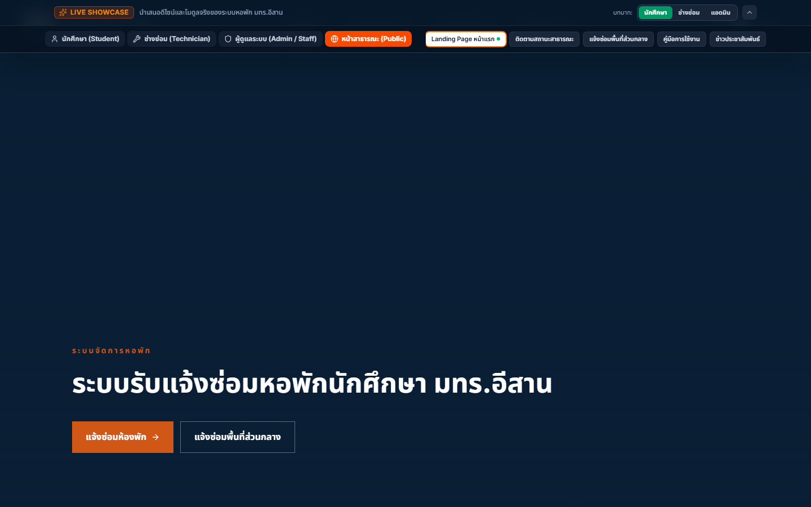
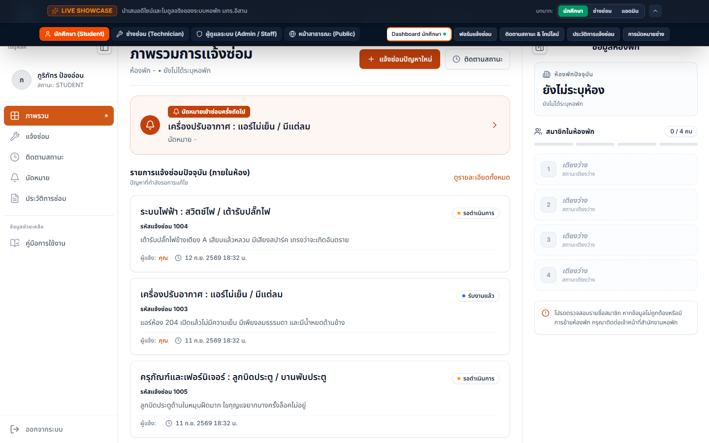
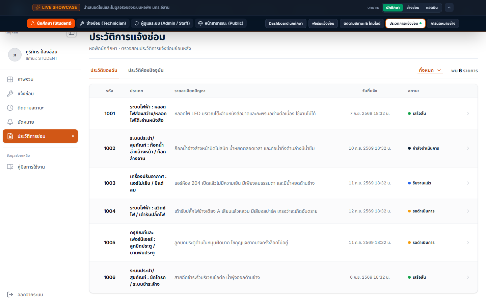

# RMUTI Dormitory System

ระบบรับแจ้งซ่อมและติดตามสถานะงานซ่อมหอพักนักศึกษา 
มหาวิทยาลัยเทคโนโลยีราชมงคลอีสาน

**[เปิด Live Demo](https://painter121.github.io/rmuti-dormitory-demo/)** · **[ดูโปรไฟล์ผู้พัฒนา](#ผู้พัฒนา)**

## ภาพรวมโปรเจกต์

RMUTI Dormitory System เป็น Interactive Frontend Showcase สำหรับระบบบริหารงานซ่อมหอพัก ออกแบบให้ผู้ใช้แต่ละบทบาทเห็นข้อมูลและขั้นตอนทำงานที่เกี่ยวข้อง ตั้งแต่การแจ้งปัญหา ติดตามความคืบหน้า นัดหมายช่าง ไปจนถึงการตรวจสอบประวัติงานซ่อม

เดโมนี้ใช้ข้อมูลจำลองทั้งหมดและไม่เชื่อมต่อฐานข้อมูลหรือระบบงานจริง ผู้เข้าชมจึงสามารถทดลองหน้าจอและ workflow ได้อย่างปลอดภัย

## UI Showcase

<table>
  <tr>
    <td width="50%">
      
    </td>
    <td width="50%">
      
    </td>
  </tr>
  <tr>
    <td align="center"><strong>Student Dashboard</strong> ภาพรวมรายการแจ้งซ่อม สถานะ และข้อมูลห้องพัก</td>
    <td align="center"><strong>Repair History</strong> ตรวจสอบงานย้อนหลังและสถานะของแต่ละรายการ</td>
  </tr>
</table>

## Workflow หลัก

**แจ้งปัญหา** → **ติดตามสถานะ** → **นัดหมายช่าง** → **ตรวจสอบประวัติ**

| Module | ความสามารถที่นำเสนอ |
|---|---|
| Student | Dashboard, แบบฟอร์มแจ้งซ่อม, Timeline สถานะ, นัดหมาย และประวัติ |
| Technician | ตารางงาน ปฏิทินงานซ่อม การใช้วัสดุ และรายงานผลงาน |
| Admin / Staff | Dashboard สถิติ จัดการงานซ่อม ห้องพัก บุคลากร และคลังอุปกรณ์ |
| Public | Landing Page, ตรวจสอบสถานะ และแจ้งซ่อมพื้นที่ส่วนกลาง |

## จุดเด่นของผลงาน

- แยกหน้าจอและ navigation ตามบทบาทของผู้ใช้งาน
- แสดงสถานะงานซ่อมด้วย card, badge และ timeline ที่อ่านง่าย
- รองรับการทดลอง workflow โดยไม่ต้องเข้าสู่ระบบจริง
- ออกแบบ Responsive UI สำหรับหน้าจอ desktop และ mobile
- พัฒนาด้วย React และ Vite พร้อม component ที่นำกลับมาใช้ซ้ำได้

## เทคโนโลยี

`React` · `Vite` · `JavaScript` · `Responsive Web Design` · `GitHub Pages`

<h2 align="center">ผู้พัฒนา</h2>

<table align="center">
  <tr>
    <td align="center" valign="middle" width="220">
      <a href="https://github.com/Painter121">  <strong>@Painter121</strong></a>
    </td>
    <td align="center" valign="middle" width="220">
      <a href="https://github.com/firstphethay11">  <strong>@firstphethay11</strong></a>
    </td>
  </tr>
</table>

ทั้งสองบัญชีร่วมพัฒนาและดูแลโปรเจกต์นี้

---

ทดลองใช้งาน: **[painter121.github.io/rmuti-dormitory-demo](https://painter121.github.io/rmuti-dormitory-demo/)**
